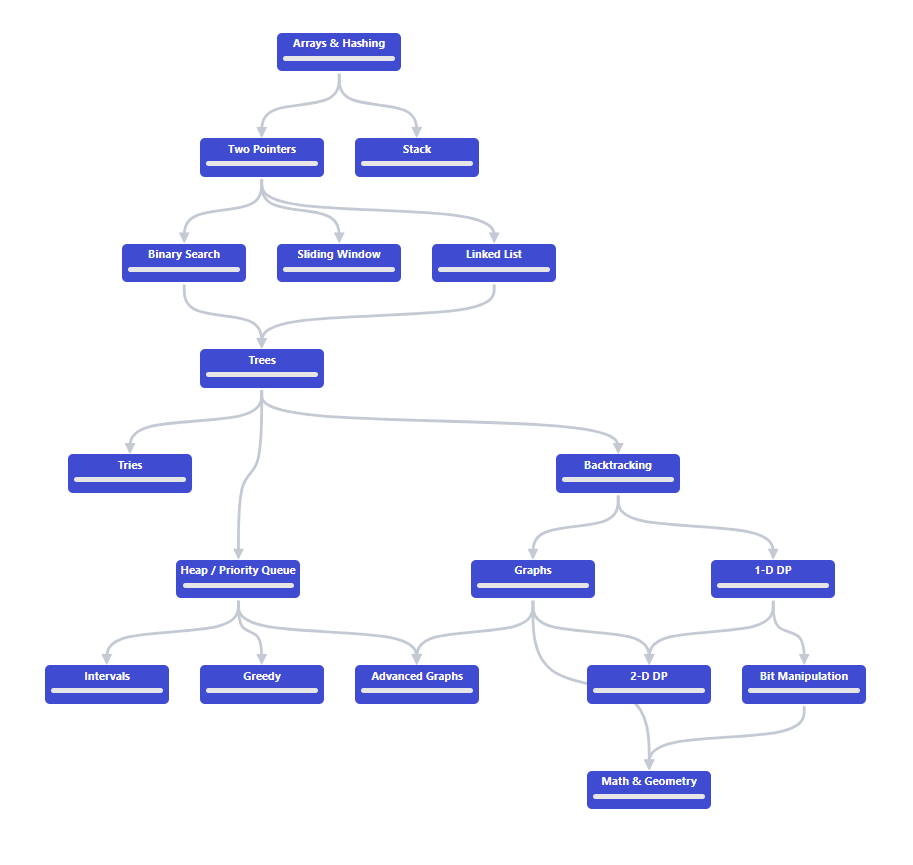

# NeetCode 150

## Overview
The <a href="https://neetcode.io/roadmap" target="_blank">NeetCode 150</a> provides a road map of 150 algorithmic problems to help you build expertise in using data structures (like arrays, stacks, and heaps) and algorithmic ideas (like backtracking, dynamic programming, and greedy algorithms). For PSU CS students, becoming proficient in these skills is very important for acing the <a href="technical-interview.html">Technical Interview</a>. They offer support for nine different programming languages, so it can be worth it to redo some of these problems when learning a new one.

<figure>
    
    <figcaption>Source: <a href="https://neetcode.io/roadmap" target="_blank">neetcode.io/roadmap</a> </figcaption>
</figure>

## Where to Start?
I would recommend starting at arrays & hashing and following the path that they provide. Skipping around is not ideal since the later units rely on knowledge you’ve gained from the prior ones. For example, binary search requires learning two pointers first, which relies on arrays, so it would be very difficult to learn binary search without learning the prior two concepts.

## What to Do When Stuck?
When stuck on a problem, first walk through one of the testcases on your own. This may give you some ideas on what algorithm to use. If you’re still stuck, NeetCode provides three hints to help guide you through the problem. I would make sure to only reveal one at a time and retry the problem to gain a greater understanding after each hint. Before looking at the solution, try using NeetCode’s chatbot to help you understand the question. If you’re still stuck, don’t be afraid to watch the video explanations under the solution tab. After watching the video, try to reimplement the solution on your own from memory.

## Tips
- If you’re trying to learn a language that NeetCode doesn’t offer, all of the problems on NeetCode are also on <a href="https://leetcode.com/" target="_blank">LeetCode</a>. You can find the specific problem number by looking at the title of the video explanation.
- LeetCode also offers more problems, so if you’re having trouble with a specific concept, try looking for similar ones on LeetCode.
